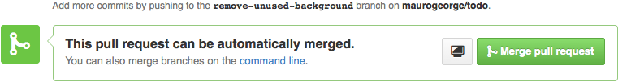
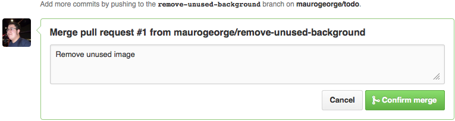
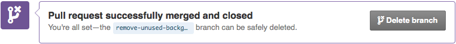

# HE:labs Blog

This is the HE:labs Blog code, you can see the live blog on http://helabs.com.br/blog/.

## Dependencies

(if you don't have technical knowledge for run the blog on your computer, please go to the [end of this README](#for-non-technical-post-please-follow-these-steps), we have some special tips for you)

To run this project you need to have:

* Ruby 2.1.2 - You can use [RVM](http://rvm.io)

## Setup the project

1. Install the depedencies above
2. Clone the project

        $ git clone git@github.com:Helabs/blog.git

3. Go into the project folder

        $ cd blog

4. Install the gem dependencies

        $ bundle install

If everything goes OK, you can now run the project!

## Running the project

1. Start the server

        $ bundle exec foreman start

2. Open [http://localhost:4000/blog/](http://localhost:4000/blog/), don't forget to put trailing '/'.

## Creating your post

1. This create a file and the branch for your post using the rake task below.

        $ rake 'new_post["Title of the post"]'

1. Write your post and **make sure the author link on the post points to your profile on HE:labs website**.
1. Commit your changes.

        $ git add .
        $ git commit -am 'post: Title of the post'

1. Push the branch.

        $ git push --set-upstream origin post/title-of-the-post

1. Send a pull request by GitHub web interface.

### Markdown

The syntax used by the blog is the markdown, you can take a look at this [cheatsheet](http://markdown.chibi.io/) for more info.

#### Code Highlighting

Use the following syntax:

```

class Say
  def hello
    say "Hello!"
  end
end

```

#### Images

Save your images in `/images/posts/YYYY-MM-DD/`. Your image URL will look like this: `/blog/images/posts/YYYY-MM-DD/`.

#### Create a list

For create a list on your post, always use hifen (the "-"), like this:

```
- item1
- item2
- item3
```

And it will look like this:

- item1
- item2
- item3

Don't use asterisk, otherwise the list will break.

## Publishing a post

1. Open the pull request's page
1. Check if the publish date is correct on the post filename. It should be the current day. If it's wrong, ask the author to fix it.
1. Click the "Merge pull request" button

    

1. Click the "Confirm merge" button

    

1. Click the "Delete branch" button

    

1. Wait a little bit and access the blog to see the new post

## Removing links to authors that are no longer on the team from blog posts

Run:

```sh
rake fix_author_links
```

Then double check if the posts were changed correctly, `git commit` and `git push` the changes back to the `gh-pages` branch.

## For non-technical post, please, follow these steps:

1) Open this file: 
https://docs.google.com/a/helabs.com.br/document/d/1HTS0j_E18AUsLxeBx2zKQ6aUwZY4Lw_JTdnpvRG3zDA/edit#

Obs: if you don't have acess to this file, please, ask for the maintainers. 

2) Read the tutorial file and let the maintainers know if there is some doubt about it.

3) When finish your post, send to one of the maintainers the google docs file.

4) After your post go online, share with your friends! ;)

## Maintainers

- [Bia](https://github.com/beatrizcp87)
- [Márcio Júnior](https://github.com/marcioj)

## Made with love by HE:labs


This app was created and is maintained by [HE:labs](https://github.com/Helabs).

## LICENSE

[Blog of HE:labs](http://helabs.com.br/blog/) and its content is licensed under an [Attribution-NonCommercial-ShareAlike 3.0 Unported license](http://creativecommons.org/licenses/by-nc-sa/3.0/legalcode).
